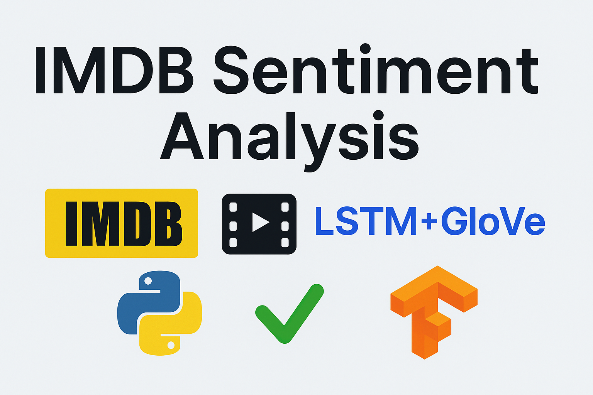

# IMDB Sentiment Analysis using LSTM with GloVe

 This project performs **Sentiment Analysis on IMDB movie reviews** using **Deep Learning (LSTM) with GloVe embeddings** to classify reviews as Positive or Negative inside a clean, structured Jupyter Notebook.

---

##  Dataset
We use the IMDB movie reviews dataset for binary sentiment classification:

 [IMDB Dataset on Kaggle (CSV)](https://www.kaggle.com/datasets/columbine/imdb-dataset-sentiment-analysis-in-csv-format)

---

##  Workflow
✅ Data Exploration (Distribution, samples, imbalance check)  
✅ Text Preprocessing (clean HTML, remove punctuation/numbers, lowercasing, stopwords removal)  
✅ Tokenization and Padding  
✅ Using GloVe embeddings with Embedding Matrix  
✅ Building an LSTM/GRU-based model  
✅ Training and evaluation on test data  
✅ Testing with custom single review input

---

##  Requirements
- Python 3.x
- pandas, numpy, matplotlib, seaborn
- nltk
- tensorflow, keras

Install with:
```bash
pip install pandas numpy matplotlib seaborn nltk tensorflow keras
 How to Run
1️-Download the dataset CSV from the Kaggle link above.
2- Place IMDB Dataset.csv in the same directory as the notebook.
3️-Open project.ipynb in Jupyter Notebook or Google Colab.
4️-Run cells sequentially to preprocess data, build, train, and evaluate the model.

 Results
Trained a binary classifier to predict IMDB movie review sentiment.

Demonstrated how GloVe + LSTM effectively handle text classification tasks.

 Kaggle Version
You can find the dataset directly on Kaggle:

 IMDB Dataset on Kaggle

 Google Colab
You can open and run the notebook directly on Google Colab:


 Contribution
Feel free to fork, open issues, or submit pull requests if you would like to improve this project.

